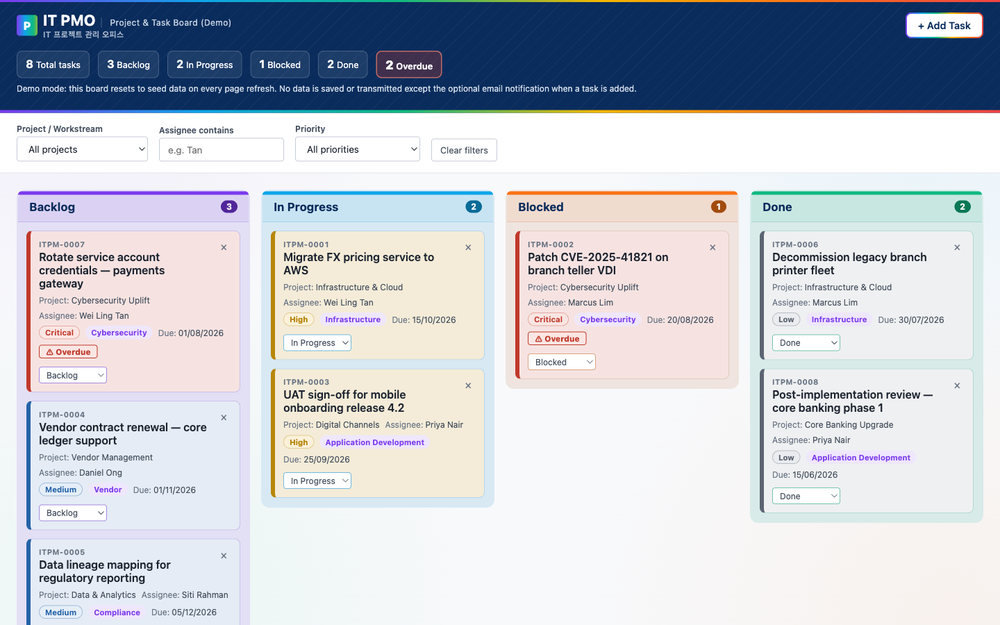

# IT PMO Kanban Board (Demo)

A single-file Kanban board demo for a fictional "IT PMO" (internal IT project
management office). This is a **training/demo artifact**, not a production system — it
deliberately avoids any real-company branding or trademarks (text wordmark with a
Korean subheading, a generic corporate-blue-and-rainbow palette).

## Live demo

[https://rjyyk4y6fc-rgb.github.io/claude-training-sep-2026/](https://rjyyk4y6fc-rgb.github.io/claude-training-sep-2026/)

## Running locally

There's no build step, package manager, or server. Everything — HTML, CSS, and
JavaScript — lives in `index.html`.

Just open `index.html` directly in a browser (double-click it, or `open index.html` on
macOS).

## What it does

- Drag-and-drop (and keyboard-accessible) task cards across four fixed columns:
  Backlog, In Progress, Blocked, Done
- Filter tasks by project, assignee, and priority
- Add new tasks via a validated form
- Optional best-effort email notification on new tasks via
  [FormSubmit](https://formsubmit.co)

## Things to know before editing

- **No persistence.** Board state lives only in an in-memory `state` object — refreshing
  the page resets it back to the seed data. This is intentional, not a bug.
- **Vanilla only.** No React/Vue/jQuery/Tailwind, no bundler, no npm dependencies, no
  external CDN scripts or fonts.
- **Single file.** All markup, styles, and script stay in `index.html` so it keeps
  working by double-clicking the file with no server.
- **FormSubmit endpoint is a placeholder.** `FORMSUBMIT_ENDPOINT` in `index.html` needs a
  real, confirmed FormSubmit address before new-task notifications will actually deliver
  — until then, that call fails silently and by design (it never blocks the UI or removes
  a card).

See [`CLAUDE.md`](CLAUDE.md) for the full architecture notes and hard constraints for
anyone (human or AI) editing this codebase.
